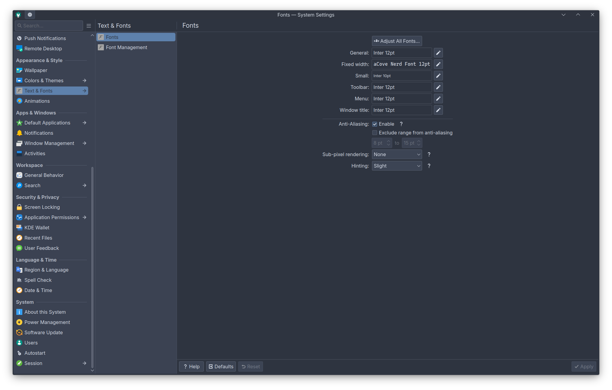
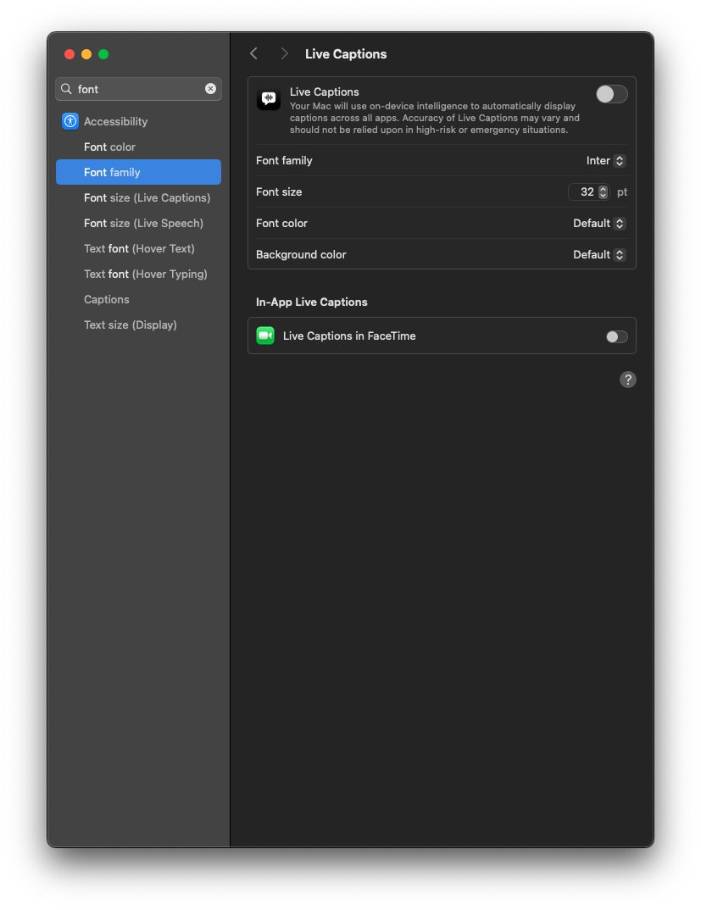
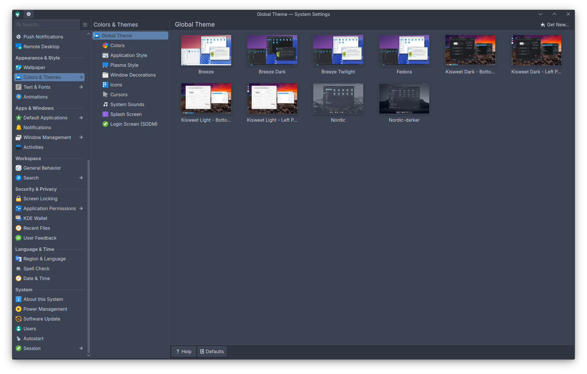
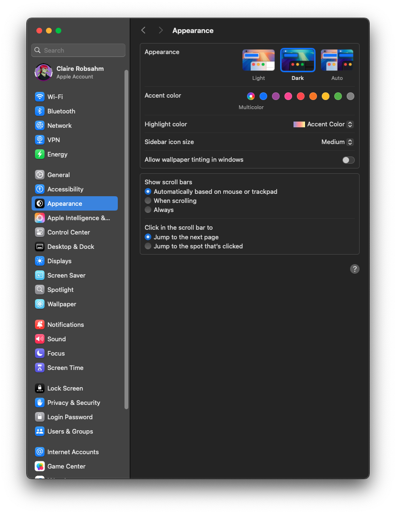

+++
title = "My Time with MacOS as a Linux User"
description = "A curse upon the name of Tim Cook! Well, okay, it wasn't THAT bad."
summary = "A curse upon the name of Tim Cook! Well, okay, it wasn't THAT bad."
tags = [ "tech", "apple", "programming" ]
author = "Claire"
toc = true
categories = [ "Blog" ]
slug = "/mac-from-linux"
date = "2025-08-02"
bluesky_url = "https://bsky.app/profile/claire.chapien.net/post/3lvhne6itv22i"

[cover]
image = "cover.png"
relative = true
large = true
caption = "The Apple logo belongs to Apple Inc. All rights reserved to Apple."
+++
# Context

My day job involves porting video games from Windows onto MacOS. For most of my life, I've been a Windows user, occasionally dabbling in Linux on the side. However, back in January of 2025, I made the switch to Linux and have not once looked back. Despite my love of Linux, however, everyone needs to eat. You cannot develop for MacOS without actually owning a Mac, and so my company provided a Mac Mini M2 for me to develop on. Last time I used Mac was when I was in Middle School, back in around 2007. Still, I never remembered it being *hard* to use per-se; only different. In all honesty, I was enthusiastic to try a new ecosystem.

Now, after using MacOS for about two months now, I regret to inform you that my enthusiasm is all but dead. Here is my story on my experiences with MacOS; what I enjoyed, what annoyed me, and what I despised.

# Unix Based

Like Linux, MacOS is ostensibly a Unix-based operating system. Immediately, I figured this would be an advantage; I'm familiar with using Linux, so surely MacOS cannot be that different. I even had a somewhat uncommon advantage; I use zsh as my primary shell on Linux. For those not in the know, zsh has been the primary shell on MacOS for a few years now, having replaced bash (which was apparently a bit controversial for the time). I was also aware that [Homebrew](https://brew.sh/) existed. A mature package manager to install any software that I couldn't get via the App Store would, in my mind, mitigate all the downsides of the "walled garden" that is the Mac ecosystem.

Unfortunately, I gravely miscalculated. My experience with Unix-based operating systems ended up being more of an obstacle than a benefit. You see, back in middle school, when I first used MacOS, I was primarily a Windows kid. I grew up using computers; my first computer was an e-machine running Windows XP that I received from my father in third grade. Before that, I used the family Windows 98 machine. I knew what a zip file was as a child; this sounds rather unimpressive, but keep in mind that many millennial and zoomer thirty year olds have no idea what a zip file is to this day.

My experience with Windows PCs did not translate at all to MacOS, obviously. This was actually advantageous; I was able to switch "modes" in my brain. I stored Mac knowledge one way, and Windows knowledge another, with little to no cross-contamination. It was like using an entirely different machine, allowing me to approach it as learning a new skill.

But now, I use Linux. And Linux has *enough* in common with MacOS that I *cannot do that*, while being *different enough* that it will screw me over. I make basic, simple mistakes I otherwise wouldn't be making if only my brain could switch into a "Mac mode". But the fact I have my zsh terminal, the fact that there's a Home folder, the fact that the file structure is pretty similar to Linux's... it all deludes my brain into thinking that I'm still on Linux. So then I do something stupid like press `ctrl+c` instead of `cmd+c`, or close my Firefox window by clicking the 'x' button like a normal person instead of clicking `Firefox -> Quit` or pressing `cmd+q` because nothing can be NORMAL on MacOS apparently!

I'll get into my UX gripes later, but for now, all you need to know is that the similarities were a hindrance. Even my beloved zsh could not save me. I thought I could simply bring over my `.zshrc` with minimal changes. I was so, so wrong. I don't know why, but Apple has completely different compiler flags set on their version of zsh. Normally, these compiler flags don't change much at all... except for the fact that one of them completely breaks my scripts!

Take, for instance, this from my `.zshrc`:

```zsh
# zinit
if [[ ! -f $HOME/.local/share/zinit/zinit.git/zinit.zsh ]]; then
    print -P "%F{33} %F{220}Installing %F{33}ZDHARMA-CONTINUUM%F{220} Initiative Plugin Manager (%F{33}zdharma-continuum/zinit%F{220})…%f"
    command mkdir -p $HOME/.local/share/zinit && command chmod g-rwX "$HOME/.local/share/zinit"
    command git clone https://github.com/zdharma-continuum/zinit "$HOME/.local/share/zinit/zinit.git" && \
        print -P "%F{33} %F{34}Installation successful.%f%b" || \
        print -P "%F{160} The clone has failed.%f%b"
fi
```

This portion of my `.zshrc` checks if zinit is installed, and if it isn't, it installs zinit. Obviously, this won't work out of the box on MacOS (though zinit DOES work on Mac with a bit of effort); that isn't what bothered me. What bothered me was that first line, the `if` statement.

The compiler settings that Apple uses on their zsh build does not support compound commands (ie `[[ foo ]]`). Or, if it does, the behavior is entirely different. None of my scripts that used if statements worked out of the box as a result. I had to manually remove a bracket -- which in most cases worked fine, but in some specific cases meant refactoring was necessary due to shell expansions.

This is an extremely technical thing, I realize, but it immediately prejudiced me against MacOS. I'm fine with things being different. I'm even fine with MacOS using their own build of zsh -- sure, distros do that all the time. My problem is there's no way to *change* that. I cannot replace their zsh build with my own. It's part of the MacOS system. I suppose I could install a secondary install of zsh through `brew`, but come on now. I'm not doing that. 

Now, all of this could be overcome. MacOS is not Linux, nor should it be. All of this would be *fine* if the UX was good, if the developer experience was good. Unfortunately...

# User Experience, the Apple Way

Apple is well-known for being "easy", at least in the realm of smartphones. I'm not going to quibble on whether or not iOS is easier to use than Android; I personally don't think so, but I understand why many do. Rather, I am here to quibble on the MacOS way of doing things. First, I want to preface this by saying that I understand this is simply how MacOS has been for a long, long time. Apple's customers are used to it working this way. That's fine. We all have our preferences.

But on my Linux install, if I really wanted to use a command key instead of a ctrl key, I could totally do that. I could go into my KDE settings, make it so my super key acts as a command key, customize it as needed and I'd have the MacOS™ experience on KDE.

I cannot do this on Apple. There is no way to swap the functionality of `cmd` and `ctrl`.

Well, that's *somewhat* untrue. It turns out, you can go into the settings and granularly make it so `ctrl` works instead of `cmd` in situations such as copy pasting. But it won't change it anywhere else. There's no way to make it so `alt+tab` works instead of `cmd+tab`, for instance. More than that, making it so copy/paste operates with `ctrl+c` instead of `cmd+c` actively *breaks* other keybindings and functionalities. I suppose this makes sense; the entire apple ecosystem is built around using a command key instead of alt or ctrl. And Apple really wants you to adopt their way of doing things. But I like *customization*. Apple, despite being the artsy, hipster cousin of FreeBSD and Linux, has almost *no customization*. It's honestly kind of shocking that a system marketed to *artists* has no *customization*.

## Customization

Let's take the system font, for instance. On KDE, if I want to change my system font, I go to `System Settings -> Fonts`, at which point I can granularly select what fonts I want to use where.



So, surely, something so simple, something that makes my operating system *mine*, can be done on the *artsy MacOS X*, right? Let's go into the settings and see.



The *closest* setting I could find was that I can change the font family for live captions. I can also change the text size for UI interfaces.

Yeah, no, that does not count.

Well, okay, not everyone is a typeface nerd!  That's fine. What about system colors? On KDE, I can go to `System Settings -> Colors & Themes`. From here, I can change my icon theme, window theme, application style, and so on. That said, all of this is pretty niche, so I won't hold it against Apple for not having these settings; GNOME does not have most of them either. The only one I want to compare against is color scheme; that, to me, feels like the minimum. Heck, individual themes that apply a color scheme would be good enough for me too, even if I prefer granular customization.



You can customize colors on iOS, from my understanding, at least to an extent. So let's see what you can do on MacOS. Surely, the operating system for *artists* will let me customize my color theme!



All I can do is set an accent color that barely appears (it does not change panels, it does not change the top bar, only highlights, radials, and so on) and change the highlight color. Oh, and I can make the sidebar icons bigger and pick between Light or Dark theme.

Even Windows can do more than this out of the box. The boring, dressed-in-a-suit Windows. Remember those "I'm a Mac" and "I'm a PC" commercials? From those, you'd expect the hipster, cool Mac to have all these customization settings. But they don't. It's frankly baffling.

## Quitting Applications is Silly

This may be more controversial, but I hate how Apple keeps programs running when you hit the 'x' button. I can understand that some programs you want backgrounded; there's a UX concept for this in other desktop environments known as a *tray icon*. Terrifying, I know. That aside, it wouldn't bother me so much if it didn't mess with functionality of programs I use.

Take Firefox, my browser of choice (because of course it's Firefox, what did you expect from me?). My settings on Firefox have always been, across both Windows and Linux, to reopen my previous tabs when starting Firefox. That means if I hit the 'x' button, and later open up Firefox, all my old tabs open back up.

Except, on MacOS... this behaves a bit differently. When you click the 'x' button, Firefox doesn't close -- it just has no windows open. Meaning if I then click the Firefox icon, relaunching it... All my tabs are gone. I am greeted with my homepage. What the hell. Now, if I *fully* quit Firefox, the tabs *are* restored -- but to do this, I have to go to the system tray ie `Firefox -> Quit` or press `cmd+q`. If I were a lifelong Mac user, maybe this wouldn't bother me. Like I said, I can even see the argument for why this behavior is the way it is. But it's *weird*. Even the command key/ctrl key distinction has a history; I can excuse that since it's just a minor adjustment. But this fundamentally changes *how I use a program that I've always used*, and because MacOS will never be my daily driver, my muscle memory will *never* adjust. Every day I'll close Firefox, then reopen it and have all my tabs gone, and go "God Damn it Steve Wozniak! WHY!". Why Wozniak? Because I believe in giving credit (and blame!) to the right people. 

# Developing on Mac: A Sisyphean Endeavor

Now, let's talk about work. I'm a programmer. A developer. A software engineer. Whatever you want to call me, I write code for a living. My Mac is meant to be for work. So most of what I do on it is work-related. So how is the developer experience on Apple?

I really don't like it, personally. First thing I did, of course, was install Homebrew. Then, with homebrew, I installed [Alacritty](https://alacritty.org/), my terminal emulator of choice, via `brew install alacritty`. I go to open it and I am greeted with... a pop up, telling me that this is an unknown program. Okay, sure, Windows can do that too. Let me click the allow button and continue. Except the button opens up settings. Oh no. The settings takes me to a list of programs and permissions. I have to manually grant its permission here.

Well, okay. That makes sense; the userbase for Apple isn't necessarily tech-savvy, and I understand protecting users. If it were something like Windows Smartscreen, I probably wouldn't even be discussing this here, since you can just click 'More..' and then 'Allow'. Having to go to the settings is annoying, but surely there's a way to toggle it, right? Tell Apple I'm a programmer who knows what I'm doing? Right?

... Right?

I install VSCodium, because it is my preferred development environment. Unknown program. Go to settings. Give permissions. I do some filesystem management from the terminal -- turns out, letting Alacritty install wasn't enough to let it actually move things around, you fool, you cretin, you idiot. Go back to the settings and give it filesystem access. God forbid I install a program on my computer without my hand being held. 

This is where the hand holding starts to *really* annoy me. As a programmer, I frequently work with hidden folders or directories (or dotfiles, as they are sometimes called). On Finder, there's no way from the UI to show hidden files. Well, that's alright. There's a shortcut (that I had to learn from Google and not my computer), `cmd+shift+.`. No big deal. I'll enable that. Alright, work's done for the day. Going to turn my computer off. I come back the next day.

Wait. My files are hidden again.

There is no way to *permanently show hidden files* in Finder. It will reset every time you relog or restart Finder. Again, I understand the desire to protect the less tech savvy but ***what the fuck***. Surely if I figured out HOW TO UNHIDE FILES, I can be TRUSTED with the hidden files, right? RIGHT, TIM?!

Whatever. Annoyances aside, I can still get my work done. I develop a bit in VSCodium. Time to make a release build. Oh, I need to sign the binary? That's fine. Security is important. I respect this a lot. Where's the signing program?

... There isn't one? I have to download and use an entire IDE, XCode? I'm expected to do all of my development there, and the only way to sign my code is WITHIN THE EDITOR? Meaning that, if I want to use VSCodium, my workflow becomes: Develop in VSCodium -> Save my project -> Close VSCodium -> Open XCode -> Compile?

Yeah, this was the last straw for my starry-eyed optimism and excitement to learn new things. MacOS has become my enemy. Every conceivable step of the way, it fought *against* me. It did not work *with* me. Linux can feel similar due to the steep learning curve, but at least once you get over that learning curve, you can make it work however you want. No such luck with MacOS. Not only is it proprietary like Windows, it also actively disrespects your intelligence. I don't understand how *anyone* tech savvy can prefer MacOS. If you are a developer who *prefers* Mac (not merely tolerates it), please tell me why. I want to know. I'm so desperate to understand. Because I'm just fed up and annoyed.

# Conclusion: Mac Annoys Me

All of this is personal preference. All of this is informed by my particular background; I'm a programmer who started on Windows and now primarily uses Linux, I have a strong preference for open source software, I enjoy granularly customizing my user experience. This is not the case for most people, and that's fine! If you like MacOS, keep doing you. This was by no means meant to be a review; instead, it was meant to be a cathartic rant about my experiences.

And it worked! I feel a lot better. Or at least, I'll feel better until Monday, when I have to log back into my Mac Mini.

Thank you for reading, I don't really know how to end this post. So I will end with a plea; Please, Tim Cook, stop making me use XCode. I don't want to 🥺